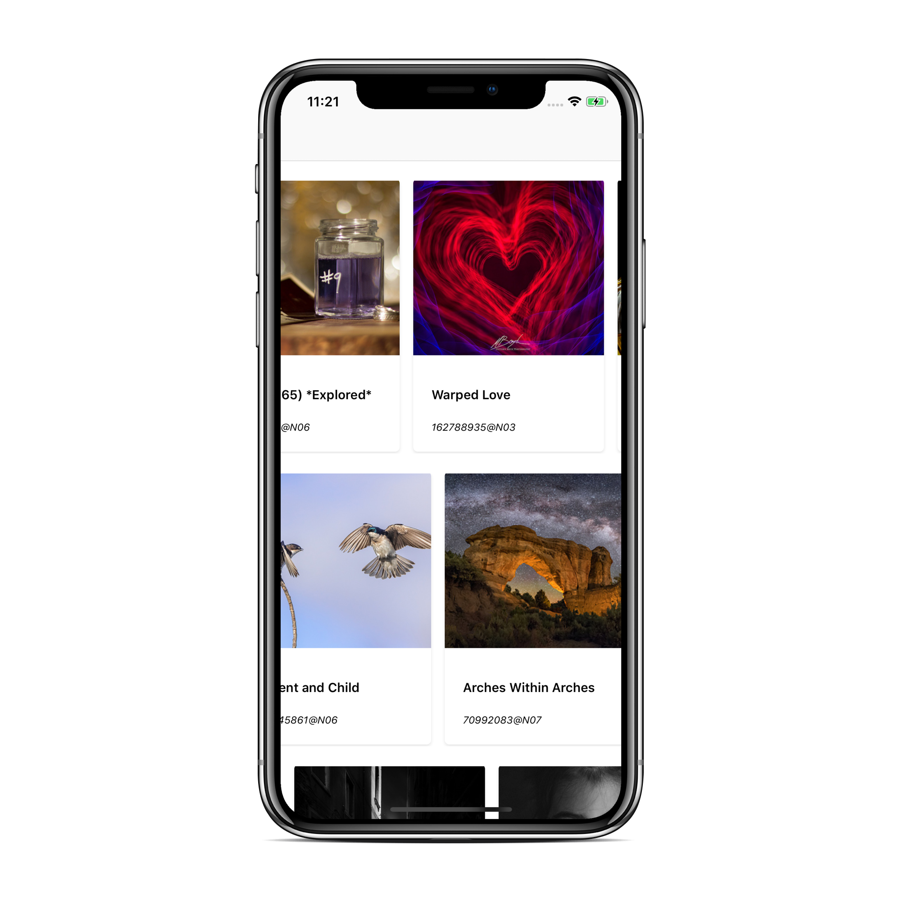

This Example project demonstrates how to:

1. Parse [Flickr API](https://www.flickr.com/services/api/) with Apple's [Combine](https://developer.apple.com/documentation/combine) framework.
2. Populate horizontal scrolling carousel UI using [UICollectionViewCompositionalLayout](https://developer.apple.com/documentation/uikit/uicollectionviewcompositionallayout).
3. Populate list view UI using [SwiftUI](https://developer.apple.com/documentation/swiftui).

with [MVVM](https://www.objc.io/issues/13-architecture/mvvm/) architecture.

## Author

* Wei-Lun Su, wsu212@gmail.com
